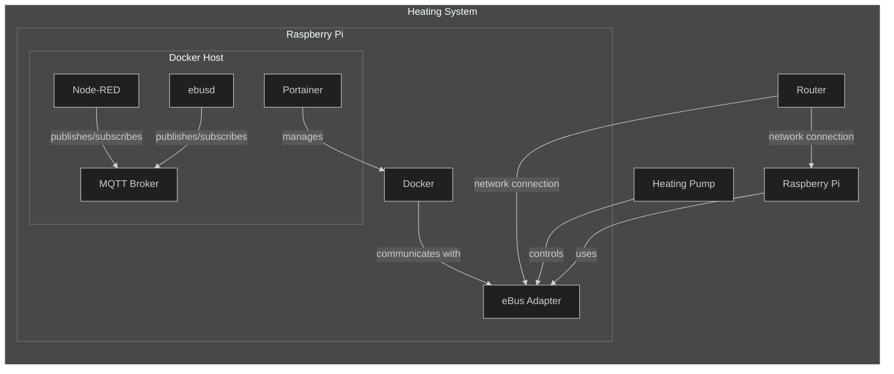

# ebusd-ochsner

This repository describes how to setup a infrastructure to control a eBUS based heating pump, in this case a Ochsner GMSW 10 HK plus (OTE3). You can setup the same for every other eBUS based heading pump, the only difference are the ebusd specific configurations.

## Helpful links

The following links are very helpful and might help understanding different topcis

- [Docker Simplified: A Hands-On Guide for Absolute Beginners](https://www.freecodecamp.org/news/docker-simplified-96639a35ff36/)
- [ebusd wiki](https://github.com/john30/ebusd/wiki)
- [eBUS Adapter Shield v5](https://adapter.ebusd.eu/v5/)
- [A brief introduction to Node-RED](https://noderedguide.com/nr-lecture-1/)
- [MQTT beginner’s guide](https://www.u-blox.com/en/blogs/insights/mqtt-beginners-guide#:~:text=MQTT%20is%20a%20publish%2Dand,topics%20handled%20by%20a%20broker.)
- [Why Portainer](https://www.portainer.io/why-portainer)

## Component overview

The heating system is composed of several interconnected components that work together to control and monitor the heating pump. The central control unit of this system is a Raspberry Pi, which is connected to the network via a general router.

### Components

- **Heating Pump:** The primary device responsible for circulating heat transfer fluid throughout the heating system.
- **eBus Adapter:** An interface device that enables communication between the heating pump and the Raspberry Pi.
- **Router:** A network device that facilitates data communication between the Raspberry Pi, the eBus Adapter, and potentially other networked devices.
- **Raspberry Pi:** A compact computer that hosts a Docker environment and serves as the brain of the system. It uses the eBus Adapter to interface with the heating pump.

### Docker Host on Raspberry Pi

Within the Raspberry Pi, a Docker host is running to manage and isolate different software components using containers. The following containers are in operation:

- **Node-RED:** A programming tool for wiring together hardware devices, APIs, and online services in new and interesting ways. It can be used to create automation flows.
- **ebusd:** A daemon for handling communication with eBus devices like the heating pump. It interfaces with the eBus Adapter to control and monitor the pump.
- **MQTT Broker:** A message broker that supports the MQTT protocol. It allows for efficient and reliable communication between the Node-RED and ebusd containers.
- **Portainer:** A management tool that provides a user-friendly interface to manage the Docker host and containers.

### Network Connections

The Raspberry Pi and the eBus Adapter both connect to the network through the Router, enabling remote access and control. This setup allows for monitoring and managing the heating system from a networked computer or a smart device.
>You can also connect the eBUS adapter via usb to your raspberry PI, there it might be necessary to install ebusd directly on you raspberry PI instead of running them inside a docker container.

The Docker containers on the Raspberry Pi communicate with each other and with external devices through the MQTT Broker and eBus Adapter, creating a robust and flexible control system for the heating pump.

## Step by step guide

The following steps provide a step by step guide to setup such an environment from the scratch.

1) [Raspberry PI and Docker](./docs/raspberry_pi_docker.md)
2) [eBUS Adapter Shield v5](./docs/ebus_adapter.md)
3) [Portainer](./docs/portainer.md)
4) [MQTT](./docs/mqtt.md)
5) [ebusd](./docs/ebusd.md)
6) [Node-RED](./docs/nodered.md)
