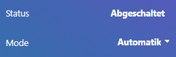

# ebusd-ochsner

This repository describes how to setup a infrastructure to control a eBUS based heating pump, in this case a Ochsner GMSW 10 HK plus (OTE3). You can setup the same for every other eBUS based heading pump, the only difference are the ebusd specific configurations.

## Helpful links

The following links are very helpful and might help understanding different topcis

- [Docker Simplified: A Hands-On Guide for Absolute Beginners](https://www.freecodecamp.org/news/docker-simplified-96639a35ff36/)
- [ebusd wiki](https://github.com/john30/ebusd/wiki)
- [eBUS Adapter Shield v5](https://adapter.ebusd.eu/v5/)
- [A brief introduction to Node-RED](https://noderedguide.com/nr-lecture-1/)
- [MQTT beginner’s guide](https://www.u-blox.com/en/blogs/insights/mqtt-beginners-guide#:~:text=MQTT%20is%20a%20publish%2Dand,topics%20handled%20by%20a%20broker.)
- [Why Portainer](https://www.portainer.io/why-portainer)

## Component overview


The heating system is composed of several interconnected components that work together to control and monitor the heating pump. The central control unit of this system is a Raspberry Pi, which is connected to the network via a general router.

### Components

- **Heating Pump:** The primary device responsible for circulating heat transfer fluid throughout the heating system.
- **eBus Adapter:** An interface device that enables communication between the heating pump and the Raspberry Pi.
- **Router:** A network device that facilitates data communication between the Raspberry Pi, the eBus Adapter, and potentially other networked devices.
- **Raspberry Pi:** A compact computer that hosts a Docker environment and serves as the brain of the system. It uses the eBus Adapter to interface with the heating pump.

### Docker Host on Raspberry Pi

Within the Raspberry Pi, a Docker host is running to manage and isolate different software components using containers. The following containers are in operation:

- **Node-RED:** A programming tool for wiring together hardware devices, APIs, and online services in new and interesting ways. It can be used to create automation flows.
- **ebusd:** A daemon for handling communication with eBus devices like the heating pump. It interfaces with the eBus Adapter to control and monitor the pump.
- **MQTT Broker:** A message broker that supports the MQTT protocol. It allows for efficient and reliable communication between the Node-RED and ebusd containers.
- **Portainer:** A management tool that provides a user-friendly interface to manage the Docker host and containers.

### Network Connections

The Raspberry Pi and the eBus Adapter both connect to the network through the Router, enabling remote access and control. This setup allows for monitoring and managing the heating system from a networked computer or a smart device.
>You can also connect the eBUS adapter via usb to your raspberry PI, there it might be necessary to install ebusd directly on you raspberry PI instead of running them inside a docker container.

The Docker containers on the Raspberry Pi communicate with each other and with external devices through the MQTT Broker and eBus Adapter, creating a robust and flexible control system for the heating pump.

## Step by step guide

The following steps provide a step by step guide to setup such an environment from the scratch.

### Raspberry PI

By following the [getting started](https://www.raspberrypi.com/documentation/computers/getting-started.html) you setup you raspberry PI. You should wire it with a ethernet cable directly to router/switch.

### Docker on Raspberry PI

Here is a [Install Docker on Raspberry Pi](https://www.simplilearn.com/tutorials/docker-tutorial/raspberry-pi-docker) guide you can follow.

### eBUS Adapter Shield v5

You need to wire the adapter with your headpump via a eBUS two-core cable. You can take a usual KNX wire for that EIB Y-(ST)-Y 2x2x0,8. You should also add use a USR-ES1 Modul mit W5500 to connect your adapter with you network via ethernet cable.
For detailed instruction refer to [eBUS Adapter Shield v5](https://adapter.ebusd.eu/v5/).

### Docker Container general

Since container are running in an isolated environment similar to a sandbox, it is recommended to map a volume to each container in order to persist data. Best practise is, to create a ``/home/pi/data`` folder where you store you container specific config files.
Following this aproche you end up with the following structure:

- ``/home/pi/data/ebusd``
- ``/home/pi/data/mqtt_data``
- ``/home/pi/data/node_red_data``
- ``/home/pi/data/portainer_data``

### Portainer

Portainer is a management tool that provides a user-friendly interface to manage the Docker host and containers. This way you can easily create, start and stop you container via a webserver.
You can follow the [How to Install Portainer on a Raspberry Pi](https://www.wundertech.net/portainer-raspberry-pi-install-how-to-install-docker-and-portainer/) guide or you can create the portainer container though the following script. The ports may depend on your system.

```sh
docker run -d -p 8000:8000 -p 9443:9443 --name portainer --restart=always -v /var/run/docker.sock:/var/run/docker.sock -v /home/pi/data/portainer_data:/data portainer/portainer-ce:latest
```

>The portainer web UI can be accessed through ``IP_ADDRESS_RASPBERRY_PI:9443``.

Once you are finished, you can add further container through portainer itself.

#### Updating portainer

Since updating portainer through portainer UI isn't possible, the following script might be helpful.

```sh
docker stop portainer
docker rm portainer
docker pull portainer/portainer-ce:latest
docker run -d -p 8000:8000 -p 9443:9443 --name portainer --restart=always -v /var/run/docker.sock:/var/run/docker.sock -v /home/pi/data/portainer_data:/data portainer/portainer-ce:latest
```

### PuTTY

Portainer is very useful to change existing contains, however sicne it does not provide to import a container setup, you need to configure it manually though the user interface. Therefor I prefer to setup the container via ssh console. Once it is created, chanching parameters becomes very convenient.

To connect with the raspberry PI I prefer using the tool [https://www.chiark.greenend.org.uk/~sgtatham/putty/latest.html](PuTTY).
To connect to it, you need to configure the IP address and the port ``22``. After that click open and type in the user (default is ``pi``) and the password.

### MQTT

MQTT is a standard messaging protocol designed specifically for use in IoT applications. It requires a so called MQTT broker.
The broker is at the heart of the system. It is responsible for receiving all messages, filtering them, and sending them to the subscribers, here the MQTT clients. An MQTT broker can potentially handle millions of connected MQTT clients.

You can create the ebusd container though the following script. The ports may depend on your system.

```sh
docker run -d -p 1883:1883 --name mqtt --restart=always -v /home/pi/data/mqtt_data/mosquitto.conf:/mosquitto/config/mosquitto.conf eclipse-mosquitto:2
```

The mosquitto.conf can be changed to your needs, here is a minimal example which I use.

```conf
allow_anonymous true
```

### ebusd

**eBUSd**(eamon) is a daemon for handling communication with eBUS devices connected to a 2-wire bus system ("energy bus" used by numerous heating systems).

#### ebusd configuration

Copy the configuration from https://github.com/Lorilatschki/ebusd-ochsner/tree/main/configuration/ochsner to you ``/home/pi/data/ebusd/ochsner``.
You can use every ssh tool for that, I prefer [FileZilla](https://filezilla-project.org/download.php?platform=win64).

You can create the ebusd container though the following script. The ports may depend on your system.

```sh
docker run --name ebusd --restart=always -p 8888:8888 -p 8080:8080 john30/ebusd -d enh:IP_ADDRESS_EBUS_ADAPTER:9999 --latency=10 --configpath=/etc/ebusd/ochsner --pollinterval=5 --mqtthost=IP_ADDRESS_RASPBERRY_PI --mqttport=1883
```
The ``IP_ADDRESS_EBUS_ADAPTER`` need to be replaced by the IP of your eBUS adapter. The ``IP_ADDRESS_RASPBERRY_PI`` need to be replaced by the IP of your raspberry PI.

#### Testing ebusd signals

In order to test whether your MQTT broker recieves messages from the ebusd, you can use the tool ``MQTT Explorer``. It can be downloaded at https://mqtt-explorer.com/.
Once you have setup the eBUS adapter, the docker containers ebusd and mqtt, you should see incoming messages with topic ``ebusd/*``.


To verify if you can change a writable eBUS address, you must append /set to the topic, switch to raw format, type in the desired value and click publish. To verify if the value has been changed by your headpump, go to the OTE display and double check it.


### Node-RED

Node-RED is a programming tool for wiring together hardware devices, APIs and online services in new and interesting ways. Since I have my dashboard already in nodered, I have integrated the eBUS there as well.

You can create the nodered container though the following script. The ports may depend on your system.

```sh
docker run --name nodered --restart=always -e TZ=Europe/Berlin -p 502:502 -p 1880:1880 -p 1883:1883 -p 3671:3671 -p 9522:9522/udp -v /home/pi/data/node_red_data:/data nodered/node-red:latest
```

>The web UI can be accessed by opening a browser and navigating to ``IP_ADDRESS_RASPBERRY_PI:1880``.

#### Required Node-RED Palletes

MQTT is already part of nodered (network). You need to install the package ``node-red-dashboard`` by navigating to ``manage palette`` in the nodered web UI.

#### Flows

A Flow is represented as a tab within the editor workspace and is the main way to organise nodes. The term “flow” is also used to informally describe a single set of connected nodes. So a flow (tab) can contain multiple flows (sets of connected nodes).

##### mqtt in

To read a topic from the mqtt broker you need to add a ``mqtt in`` element and configure the server by using IP_ADDRESS_RASPBERRY_PI:1883. The output can be connected to a convert function to extract the raw value of the message and send it to a lable of the dashboard.

> The nodered dashboard can be accessed via IP_ADDRESS_RASPBERRY_PI:1880


<details>
  <summary>nodered json export</summary>

```json
[
    {
        "id": "902b57b3ac76377f",
        "type": "mqtt in",
        "z": "5051abe90dd1522b",
        "name": "",
        "topic": "ebusd/24849/mode.heating",
        "qos": "2",
        "datatype": "auto-detect",
        "broker": "257ca8e2d3ee022c",
        "nl": false,
        "rap": true,
        "rh": 0,
        "inputs": 0,
        "x": 370,
        "y": 920,
        "wires": [
            [
                "a74c5172a6379827"
            ]
        ]
    },
    {
        "id": "a74c5172a6379827",
        "type": "function",
        "z": "5051abe90dd1522b",
        "name": "convert to string",
        "func": "var split = msg.payload.split(';');\nmsg.payload = split[split.length - 1];\nreturn msg;",
        "outputs": 1,
        "timeout": 0,
        "noerr": 0,
        "initialize": "",
        "finalize": "",
        "libs": [],
        "x": 700,
        "y": 920,
        "wires": [
            [
                "56c277b6547d6426"
            ]
        ]
    },
    {
        "id": "b6ca43aeb8aa2d43",
        "type": "mqtt out",
        "z": "5051abe90dd1522b",
        "name": "",
        "topic": "ebusd/24849/mode.heating/set",
        "qos": "2",
        "retain": "",
        "respTopic": "",
        "contentType": "",
        "userProps": "",
        "correl": "",
        "expiry": "",
        "broker": "257ca8e2d3ee022c",
        "x": 1150,
        "y": 920,
        "wires": []
    },
    {
        "id": "56c277b6547d6426",
        "type": "ui_dropdown",
        "z": "5051abe90dd1522b",
        "name": "",
        "label": "",
        "tooltip": "",
        "place": "",
        "group": "cad7657ab75b8314",
        "order": 2,
        "width": "3",
        "height": "1",
        "passthru": false,
        "multiple": false,
        "options": [
            {
                "label": "Standbybetrieb",
                "value": "0",
                "type": "str"
            },
            {
                "label": "Automatik",
                "value": "1",
                "type": "str"
            },
            {
                "label": "Normalbetrieb",
                "value": "4",
                "type": "str"
            },
            {
                "label": "Sparbetrieb",
                "value": "5",
                "type": "str"
            },
            {
                "label": "Handbetrieb Heizen",
                "value": "7",
                "type": "str"
            },
            {
                "label": "Handbetrieb Kühlen",
                "value": "8",
                "type": "str"
            }
        ],
        "payload": "",
        "topic": "topic",
        "topicType": "msg",
        "className": "",
        "x": 920,
        "y": 920,
        "wires": [
            [
                "b6ca43aeb8aa2d43"
            ]
        ]
    },
    {
        "id": "257ca8e2d3ee022c",
        "type": "mqtt-broker",
        "name": "",
        "broker": "192.168.1.8",
        "port": "1883",
        "clientid": "",
        "autoConnect": true,
        "usetls": false,
        "protocolVersion": "4",
        "keepalive": "60",
        "cleansession": true,
        "autoUnsubscribe": true,
        "birthTopic": "",
        "birthQos": "0",
        "birthRetain": "false",
        "birthPayload": "",
        "birthMsg": {},
        "closeTopic": "",
        "closeQos": "0",
        "closeRetain": "false",
        "closePayload": "",
        "closeMsg": {},
        "willTopic": "",
        "willQos": "0",
        "willRetain": "false",
        "willPayload": "",
        "willMsg": {},
        "userProps": "",
        "sessionExpiry": ""
    },
    {
        "id": "cad7657ab75b8314",
        "type": "ui_group",
        "name": "Heizkreis",
        "tab": "ef317f27bee1a13c",
        "order": 2,
        "disp": true,
        "width": "6",
        "collapse": false,
        "className": ""
    },
    {
        "id": "ef317f27bee1a13c",
        "type": "ui_tab",
        "name": "Heizung",
        "icon": "fa-thermometer-empty",
        "order": 8,
        "disabled": false,
        "hidden": false
    }
]
```
</details>

##### mqtt out

 To write a message to a topic, you need to add a ``mqtt out`` element and configure the server. This can be combined to show the current mode of the headpump and make it changeable though a combobox.
 > Notice that you need to add a ``/set`` suffix to the mqtt topic.


<details>
<summary>nodered json export</summary>

```json
[
    {
        "id": "902b57b3ac76377f",
        "type": "mqtt in",
        "z": "5051abe90dd1522b",
        "name": "",
        "topic": "ebusd/24849/mode.heating",
        "qos": "2",
        "datatype": "auto-detect",
        "broker": "257ca8e2d3ee022c",
        "nl": false,
        "rap": true,
        "rh": 0,
        "inputs": 0,
        "x": 370,
        "y": 920,
        "wires": [
            [
                "a74c5172a6379827"
            ]
        ]
    },
    {
        "id": "a74c5172a6379827",
        "type": "function",
        "z": "5051abe90dd1522b",
        "name": "convert to string",
        "func": "var split = msg.payload.split(';');\nmsg.payload = split[split.length - 1];\nreturn msg;",
        "outputs": 1,
        "timeout": 0,
        "noerr": 0,
        "initialize": "",
        "finalize": "",
        "libs": [],
        "x": 700,
        "y": 920,
        "wires": [
            [
                "56c277b6547d6426"
            ]
        ]
    },
    {
        "id": "b6ca43aeb8aa2d43",
        "type": "mqtt out",
        "z": "5051abe90dd1522b",
        "name": "",
        "topic": "ebusd/24849/mode.heating/set",
        "qos": "2",
        "retain": "",
        "respTopic": "",
        "contentType": "",
        "userProps": "",
        "correl": "",
        "expiry": "",
        "broker": "257ca8e2d3ee022c",
        "x": 1150,
        "y": 920,
        "wires": []
    },
    {
        "id": "56c277b6547d6426",
        "type": "ui_dropdown",
        "z": "5051abe90dd1522b",
        "name": "",
        "label": "",
        "tooltip": "",
        "place": "",
        "group": "cad7657ab75b8314",
        "order": 2,
        "width": "3",
        "height": "1",
        "passthru": false,
        "multiple": false,
        "options": [
            {
                "label": "Standbybetrieb",
                "value": "0",
                "type": "str"
            },
            {
                "label": "Automatik",
                "value": "1",
                "type": "str"
            },
            {
                "label": "Normalbetrieb",
                "value": "4",
                "type": "str"
            },
            {
                "label": "Sparbetrieb",
                "value": "5",
                "type": "str"
            },
            {
                "label": "Handbetrieb Heizen",
                "value": "7",
                "type": "str"
            },
            {
                "label": "Handbetrieb Kühlen",
                "value": "8",
                "type": "str"
            }
        ],
        "payload": "",
        "topic": "topic",
        "topicType": "msg",
        "className": "",
        "x": 920,
        "y": 920,
        "wires": [
            [
                "b6ca43aeb8aa2d43"
            ]
        ]
    },
    {
        "id": "257ca8e2d3ee022c",
        "type": "mqtt-broker",
        "name": "",
        "broker": "192.168.1.8",
        "port": "1883",
        "clientid": "",
        "autoConnect": true,
        "usetls": false,
        "protocolVersion": "4",
        "keepalive": "60",
        "cleansession": true,
        "autoUnsubscribe": true,
        "birthTopic": "",
        "birthQos": "0",
        "birthRetain": "false",
        "birthPayload": "",
        "birthMsg": {},
        "closeTopic": "",
        "closeQos": "0",
        "closeRetain": "false",
        "closePayload": "",
        "closeMsg": {},
        "willTopic": "",
        "willQos": "0",
        "willRetain": "false",
        "willPayload": "",
        "willMsg": {},
        "userProps": "",
        "sessionExpiry": ""
    },
    {
        "id": "cad7657ab75b8314",
        "type": "ui_group",
        "name": "Heizkreis",
        "tab": "ef317f27bee1a13c",
        "order": 2,
        "disp": true,
        "width": "6",
        "collapse": false,
        "className": ""
    },
    {
        "id": "ef317f27bee1a13c",
        "type": "ui_tab",
        "name": "Heizung",
        "icon": "fa-thermometer-empty",
        "order": 8,
        "disabled": false,
        "hidden": false
    }
]
```
</details>

The items on the dashboard look similar to that. _I have changed my global css style, that's why it might look different than you used to.



