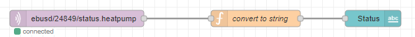
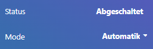
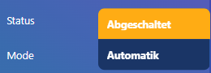

# Node-RED

Node-RED is a programming tool for wiring together hardware devices, APIs and online services in new and interesting ways. Since I have my dashboard already in nodered, I have integrated the eBUS there as well.

You can create the nodered container though the following script. The ports may depend on your system.

```sh
docker run -d --name nodered --restart=always -e TZ=Europe/Berlin -p 502:502 -p 1880:1880 -p 1883:1883 -p 3671:3671 -p 9522:9522/udp -v /home/pi/data/node_red_data:/data nodered/node-red:latest
```

>The web UI can be accessed by opening a browser and navigating to ``IP_ADDRESS_RASPBERRY_PI:1880``.

## Required Node-RED Palletes

MQTT is already part of nodered (network). You need to install the package ``node-red-dashboard`` by navigating to ``manage palette`` in the nodered web UI.

## Flows

A Flow is represented as a tab within the editor workspace and is the main way to organize nodes. The term “flow” is also used to informally describe a single set of connected nodes. So a flow (tab) can contain multiple flows (sets of connected nodes).

### MQTT In

To read a topic from the mqtt broker you need to add a ``mqtt in`` element and configure the server by using IP_ADDRESS_RASPBERRY_PI:1883. The output can be connected to a convert function to extract the raw value of the message and send it to a label of the dashboard.

> The nodered dashboard can be accessed via IP_ADDRESS_RASPBERRY_PI:1880



<details>
  <summary>nodered json export</summary>

```json
[
    {
        "id": "902b57b3ac76377f",
        "type": "mqtt in",
        "z": "5051abe90dd1522b",
        "name": "",
        "topic": "ebusd/24849/mode.heating",
        "qos": "2",
        "datatype": "auto-detect",
        "broker": "257ca8e2d3ee022c",
        "nl": false,
        "rap": true,
        "rh": 0,
        "inputs": 0,
        "x": 370,
        "y": 920,
        "wires": [
            [
                "a74c5172a6379827"
            ]
        ]
    },
    {
        "id": "a74c5172a6379827",
        "type": "function",
        "z": "5051abe90dd1522b",
        "name": "convert to string",
        "func": "var split = msg.payload.split(';');\nmsg.payload = split[split.length - 1];\nreturn msg;",
        "outputs": 1,
        "timeout": 0,
        "noerr": 0,
        "initialize": "",
        "finalize": "",
        "libs": [],
        "x": 700,
        "y": 920,
        "wires": [
            [
                "56c277b6547d6426"
            ]
        ]
    },
    {
        "id": "b6ca43aeb8aa2d43",
        "type": "mqtt out",
        "z": "5051abe90dd1522b",
        "name": "",
        "topic": "ebusd/24849/mode.heating/set",
        "qos": "2",
        "retain": "",
        "respTopic": "",
        "contentType": "",
        "userProps": "",
        "correl": "",
        "expiry": "",
        "broker": "257ca8e2d3ee022c",
        "x": 1150,
        "y": 920,
        "wires": []
    },
    {
        "id": "56c277b6547d6426",
        "type": "ui_dropdown",
        "z": "5051abe90dd1522b",
        "name": "",
        "label": "",
        "tooltip": "",
        "place": "",
        "group": "cad7657ab75b8314",
        "order": 2,
        "width": "3",
        "height": "1",
        "passthru": false,
        "multiple": false,
        "options": [
            {
                "label": "Standbybetrieb",
                "value": "0",
                "type": "str"
            },
            {
                "label": "Automatik",
                "value": "1",
                "type": "str"
            },
            {
                "label": "Normalbetrieb",
                "value": "4",
                "type": "str"
            },
            {
                "label": "Sparbetrieb",
                "value": "5",
                "type": "str"
            },
            {
                "label": "Handbetrieb Heizen",
                "value": "7",
                "type": "str"
            },
            {
                "label": "Handbetrieb Kühlen",
                "value": "8",
                "type": "str"
            }
        ],
        "payload": "",
        "topic": "topic",
        "topicType": "msg",
        "className": "",
        "x": 920,
        "y": 920,
        "wires": [
            [
                "b6ca43aeb8aa2d43"
            ]
        ]
    },
    {
        "id": "257ca8e2d3ee022c",
        "type": "mqtt-broker",
        "name": "",
        "broker": "192.168.1.8",
        "port": "1883",
        "clientid": "",
        "autoConnect": true,
        "usetls": false,
        "protocolVersion": "4",
        "keepalive": "60",
        "cleansession": true,
        "autoUnsubscribe": true,
        "birthTopic": "",
        "birthQos": "0",
        "birthRetain": "false",
        "birthPayload": "",
        "birthMsg": {},
        "closeTopic": "",
        "closeQos": "0",
        "closeRetain": "false",
        "closePayload": "",
        "closeMsg": {},
        "willTopic": "",
        "willQos": "0",
        "willRetain": "false",
        "willPayload": "",
        "willMsg": {},
        "userProps": "",
        "sessionExpiry": ""
    },
    {
        "id": "cad7657ab75b8314",
        "type": "ui_group",
        "name": "Heizkreis",
        "tab": "ef317f27bee1a13c",
        "order": 2,
        "disp": true,
        "width": "6",
        "collapse": false,
        "className": ""
    },
    {
        "id": "ef317f27bee1a13c",
        "type": "ui_tab",
        "name": "Heizung",
        "icon": "fa-thermometer-empty",
        "order": 8,
        "disabled": false,
        "hidden": false
    }
]
```
</details>

### MQTT Out

 To write a message to a topic, you need to add a ``mqtt out`` element and configure the server. This can be combined to show the current mode of the head bump and make it changeable though a combobox.
 > Notice that you need to add a ``/set`` suffix to the mqtt topic.


<details>
<summary>nodered json export</summary>

```json
[
    {
        "id": "902b57b3ac76377f",
        "type": "mqtt in",
        "z": "5051abe90dd1522b",
        "name": "",
        "topic": "ebusd/24849/mode.heating",
        "qos": "2",
        "datatype": "auto-detect",
        "broker": "257ca8e2d3ee022c",
        "nl": false,
        "rap": true,
        "rh": 0,
        "inputs": 0,
        "x": 370,
        "y": 920,
        "wires": [
            [
                "a74c5172a6379827"
            ]
        ]
    },
    {
        "id": "a74c5172a6379827",
        "type": "function",
        "z": "5051abe90dd1522b",
        "name": "convert to string",
        "func": "var split = msg.payload.split(';');\nmsg.payload = split[split.length - 1];\nreturn msg;",
        "outputs": 1,
        "timeout": 0,
        "noerr": 0,
        "initialize": "",
        "finalize": "",
        "libs": [],
        "x": 700,
        "y": 920,
        "wires": [
            [
                "56c277b6547d6426"
            ]
        ]
    },
    {
        "id": "b6ca43aeb8aa2d43",
        "type": "mqtt out",
        "z": "5051abe90dd1522b",
        "name": "",
        "topic": "ebusd/24849/mode.heating/set",
        "qos": "2",
        "retain": "",
        "respTopic": "",
        "contentType": "",
        "userProps": "",
        "correl": "",
        "expiry": "",
        "broker": "257ca8e2d3ee022c",
        "x": 1150,
        "y": 920,
        "wires": []
    },
    {
        "id": "56c277b6547d6426",
        "type": "ui_dropdown",
        "z": "5051abe90dd1522b",
        "name": "",
        "label": "",
        "tooltip": "",
        "place": "",
        "group": "cad7657ab75b8314",
        "order": 2,
        "width": "3",
        "height": "1",
        "passthru": false,
        "multiple": false,
        "options": [
            {
                "label": "Standbybetrieb",
                "value": "0",
                "type": "str"
            },
            {
                "label": "Automatik",
                "value": "1",
                "type": "str"
            },
            {
                "label": "Normalbetrieb",
                "value": "4",
                "type": "str"
            },
            {
                "label": "Sparbetrieb",
                "value": "5",
                "type": "str"
            },
            {
                "label": "Handbetrieb Heizen",
                "value": "7",
                "type": "str"
            },
            {
                "label": "Handbetrieb Kühlen",
                "value": "8",
                "type": "str"
            }
        ],
        "payload": "",
        "topic": "topic",
        "topicType": "msg",
        "className": "",
        "x": 920,
        "y": 920,
        "wires": [
            [
                "b6ca43aeb8aa2d43"
            ]
        ]
    },
    {
        "id": "257ca8e2d3ee022c",
        "type": "mqtt-broker",
        "name": "",
        "broker": "192.168.1.8",
        "port": "1883",
        "clientid": "",
        "autoConnect": true,
        "usetls": false,
        "protocolVersion": "4",
        "keepalive": "60",
        "cleansession": true,
        "autoUnsubscribe": true,
        "birthTopic": "",
        "birthQos": "0",
        "birthRetain": "false",
        "birthPayload": "",
        "birthMsg": {},
        "closeTopic": "",
        "closeQos": "0",
        "closeRetain": "false",
        "closePayload": "",
        "closeMsg": {},
        "willTopic": "",
        "willQos": "0",
        "willRetain": "false",
        "willPayload": "",
        "willMsg": {},
        "userProps": "",
        "sessionExpiry": ""
    },
    {
        "id": "cad7657ab75b8314",
        "type": "ui_group",
        "name": "Heizkreis",
        "tab": "ef317f27bee1a13c",
        "order": 2,
        "disp": true,
        "width": "6",
        "collapse": false,
        "className": ""
    },
    {
        "id": "ef317f27bee1a13c",
        "type": "ui_tab",
        "name": "Heizung",
        "icon": "fa-thermometer-empty",
        "order": 8,
        "disabled": false,
        "hidden": false
    }
]
```
</details>

The items on the dashboard look similar to that. I have changed my global css style, that's why it might look different than you used to.



