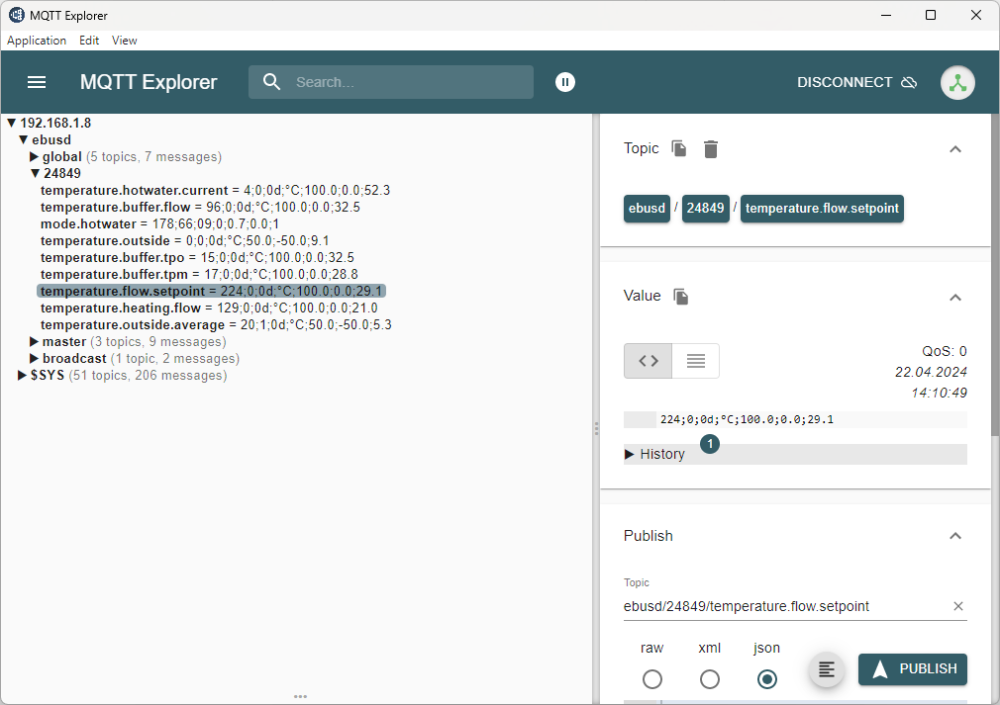

# ebusd

**eBUSd**(eamon) is a daemon for handling communication with eBUS devices connected to a 2-wire bus system ("energy bus" used by numerous heating systems).

## ebusd configuration

Copy the configuration from https://github.com/Lorilatschki/ebusd-ochsner/tree/main/configuration/ochsner to you ``/home/pi/data/ebusd/ochsner``.
You can use every ssh tool for that, I prefer [FileZilla](https://filezilla-project.org/download.php?platform=win64).

You can create the ebusd container though the following script. The ports may depend on your system.

```sh
docker run --name ebusd --restart=always -p 8888:8888 -p 8080:8080 john30/ebusd -d enh:IP_ADDRESS_EBUS_ADAPTER:9999 --latency=10 --configpath=/etc/ebusd/ochsner --pollinterval=5 --mqtthost=IP_ADDRESS_RASPBERRY_PI --mqttport=1883
```

The ``IP_ADDRESS_EBUS_ADAPTER`` need to be replaced by the IP of your eBUS adapter. The ``IP_ADDRESS_RASPBERRY_PI`` need to be replaced by the IP of your raspberry Pi.

## Adapting ebusd configuration

The addresses used for my heading pump might not fit yours. In the configuration, you find the eBUS-ID next to each configuration row in the comments field. It has the format XX-XXX for instance the ``setpoint desired hotwater normal`` with id ``05-051``.
To find the correct address in your environment, you need to use the ebusd ``ebusctl grap result all decode`` command.

1) To connect to the ebusd container via console go to the container in the portainer web UI and click the ``Exec Console`` and click ``Connect``.

2) Switch to your mapped volume via ``cd etc/ebusd/ochsner/``
3) Run the ``ebusctl grap result all decode >> decode.all.txt`` to write the decode content into the ``etc/ebusd/ochsner/decode.all.txt`` file
4) Connect to the raspberry pi via ssh explorer e.g. FileZilla and download the file to you local computer
5) Open a file viewer e.g. notepad++ and search for the desired eBUS-ID
6) Search for the eBUS-ID ``05-051`` and look for the TEM_P XXXX= prefix.

```txt
...
TEM_P b342=05-051, 428d=26-066, 8d02=05-013, 0258=16-002, 5802=04-088, 0264=08-002, 6400=00-100, 00f4=08-000, f401=03-116
...
```

7) Scroll upwards until you find a address block with the structure ``XXXXXXXXXXXXXXXXXX / XXXXXXXXXXXXXXXXXXXXXX``

```txt
...
31150621046580000e / 0ab3428d0258026400f401 = 9
...
```
8) The final address are the last 8 characters of the first segment ``6580000e``
9) Go to your config and change the address of the corresponding row

```csv
r1,,temperature.hotwater.normal.set,05-051 Setpoint desired hot water temperature,,,,6580000e,,,param,,,,,,tempt,,,,,,,,,,,,,,,,,,,,,,,,,,,,,,,,,,,,,,,,,,,,,,,,,,,,,,,,,
w,,temperature.hotwater.normal.set,05-051 Setpoint desired hot water temperature,,,,6580000e,,,tempt,,,,,,,,,,,,,,,,,,,,,,,,,,,,,,,,,,,,,,,,,,,,,,,,,,,,,,,,,,,,,,,
```
10) Connect to your raspberry Pi and copy the config to the ``/home/pi/data/ebusd/ochsner`` folder and **override** the existing one
11) In order to reload the configuration by ebusd, you can simply recreate the container through portainer by clicking the ``Recreate`` button


## Testing ebusd signals

In order to test whether your MQTT broker recieves messages from the ebusd, you can use the tool ``MQTT Explorer``. It can be downloaded [here](https://mqtt-explorer.com/).

### Read Signals

Once you have setup the eBUS adapter, the docker containers ebusd and mqtt, you should see incoming messages with topic ``ebusd/*``.



### Write Signals

To verify if you can change a writable eBUS address, you must append ``/set`` to the topic, switch to raw format, type in the desired value and click publish. To verify if the value has been changed by your headpump, go to the OTE display and double check it.


